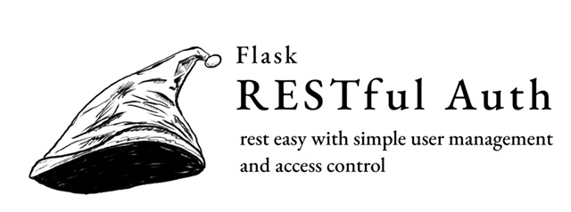

--------------------------------------------------------------------------------

This is where a long description of our package will go...

# Setup (Mac/Linux)

1. `cd Flask-RESTful-Auth`
2. `python3 -m venv venv`
3. `source venv/bin/activate`
4. `pip install -r requirements.txt`

# Setup (Windows)

1. ` cd .\Flask-RESTful-Auth\`
2. `python -m venv venv`
3. `.\venv\Scripts\Activate.ps1`
4. `pip install -r requirements.txt`

# Run the example

Windows: `python .\examples\00_basic\app.py`

Unix: `python ./examples/00_basic/app.py`